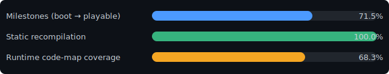

# Scooby-Doo! Night of 100 Frights — Native PC Port (GameCube Recomp)

_Progress generated 2026-07-20 by `tools/gen_progress.py`. Run it after a session to refresh._

## Overall (distance to FULLY PLAYABLE on PC)

`█████████████░░░░░░░░░░░░░░░░░` **42%**

## Metrics

| Metric | Value | |
|---|---|---|
| Static recompilation | 416,072 / 416,072 instructions (100%) | `████████████████████` |
| Runtime code-map coverage | 295 / 407 code pages entered (72.5%) | `██████████████░░░░░░` |
| Runtime dispatch entry points executed | 7,999 | |
| Deepest instrumented run | 822,083,584 dispatch blocks | |

_Static recompilation = share of the game's PowerPC code DolRecomp emitted C for (the Gekko decoder handled everything, incl. paired singles)._
_Code-map coverage = share of 4KB pages of game code the harness has entered — grows as the game gets deeper into boot/gameplay. (Menus/boot exercise a small slice of a game's code; in-game play is what pushes this up.)_

## Milestones

- [x] Game extracted (RVZ -> DOL + 329 asset files)
- [x] main.dol statically recompiled (0 unknown instructions)
- [x] Runtime harness: DOL loads, recompiled code executes
- [x] Hardware init survives (PI / DSP / ARAM / AI mailboxes)
- [x] OS threading + interrupt delivery (retrace, wakeups)
- [x] DVD/DI serving: inquiry + real file reads from disc image
- [x] Engine type-registry boot (bss-loader root-cause fix)
- [x] VI framebuffer presented in a host window (first pixels)
- [x] GX software rasterizer: 2D UI renders (textures + CI4/CI8)
- [x] SI controller detected (transfer buffer + SI interrupt)
- [x] Memory-card dialog advances (input gate cracked)
- [x] Post-dialog level/world data streams from disc
- [x] World loads: RenderWare models instantiate (chars/powerups)
- [x] Post-load scene begins rendering (loading UI + sky)
- [x] 3D intro scene renders natively (Scooby on screen!)
- [x] Intro cutscene plays (gang animated, Z-buffer, blending)
- [x] TITLE SCREEN renders (logo + 3D haunted house)
- [x] First level loads + world renders in-game (h001)
- [x] In-level crash fixed: level renders indefinitely (UAF)
- [x] Intro cutscene plays to completion (Bink FMV end-to-end, frames visible)
- [x] PLAYABLE: control unlocks after the cutscene; Scooby walks under input
- [x] Playable at correct real speed (wall-clock timebase, 50Hz vblank)
- [x] Hub world renders textured with the correct 3rd-person camera (BSP walk + main-camera capture)
- [ ] Stable level transitions: real async load completions (hub <-> areas, no dual-world hangs)
- [ ] Characters/entities render complete, incl. skinned animation (Scooby walks visibly)
- [ ] Compositing correct: flicker-free presents, effects (lightning), texture-streaming residency
- [ ] HUD + 2D text render correctly (currently mirrored/garbled)
- [ ] Title screen menu interactive (input-driven)
- [ ] Full input path (SDK SI/PAD poll driven by the game itself)
- [ ] All levels load + render verified (full world tour)
- [ ] Framerate: hold native 25fps everywhere, then a 60fps mode
- [ ] Modern resolutions (internal render scale, window/fullscreen)
- [ ] Saves persist (memory-card emulation end-to-end)
- [ ] Audio (DSP-HLE / music + SFX) — LAST per user preference
- [x] Long-session stability: real async load completions (deep-UAF ceiling broken, 18-22k+ frames no crash)
- [ ] Packaging: clean user-supplied-disc flow, no game assets shipped

## Subsystem status

| Subsystem | Status | Notes |
|---|---|---|
| CPU (Gekko/PPC750 + paired singles) | ✅ done | DolRecomp static recompilation, 0 unknown instructions |
| OS threading / interrupts | ✅ done | retrace emulation, OSWakeupThread, DI/SI delivery |
| DVD / DI | ✅ works | inquiry + file reads from disc.iso; async completion latency to tune |
| VI (video out) | ✅ works | XFB → Win32 window blit each vsync |
| GX (GPU) | 🟨 renders | software rasterizer: tris/strips, textures, TLUT, Z-buffer, blending; 3D level scenes render (lighting/TEV polish pending) |
| SI (controllers) | 🟨 works (host keys) | host keyboard drives gameplay via an engine-level pad inject (SCOOBY_PLAY=1); the game's own SDK SI/PAD poll path is not yet exercised in-level |
| EXI / memory card | 🟨 stub | "no card" path works; saving not implemented |
| DSP / AI (audio) | 🟥 stubs | mailbox handshake HLE only; no sound |

## Current frontier

**THE GAME IS PLAYABLE.** The full natural flow works end-to-end with no hacks: boot,
h001 loads, the intro cutscene (`fmv/cin1.bik`) plays all 4,761 frames to completion at
emulation speed (~4 min wall), the game's own finalize runs, Scooby looks around — and
player control unlocks: he **walks under held input** (verified via the engine's live
animation state: `Idle_normal` -> `Idle_LookLeft/Right` -> `Walk_brave`, sustained). The
world simulates fully (544 entities update every frame). Host keyboard drives the game
(`SCOOBY_PLAY=1`; arrows = move). The game now runs at **correct real speed** by default:
a wall-clock timebase (real 40.5 MHz) with 50 Hz PAL vblank pacing, made stable by an HLE
of the GPU draw-sync fence our synchronous software rasterizer can't satisfy mid-frame.
**The intro movie is now visible on screen** (the Bink pipeline was fully working; a
one-line-class TEV alpha-env fix in the rasterizer made the video quad opaque).
Remaining work is quality, not progression: interpreter performance (in-level ~17-28
fps, video decode ~11 fps), camera/lighting/TEV polish, and audio.
